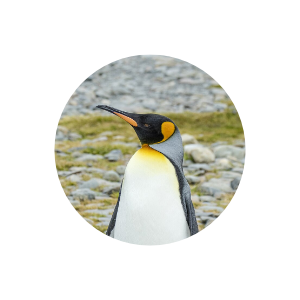

# Welcome!

Welcome to PengTrackersPro! This app gives you easy access to viewing nesting site locations and summaries for many different penguin species. It's purpose is to be informative and fun! 

## How to start

Upon downloading the project, you will need to install the required dependencies by running

### `npm i`

To start the app (on port 3000), go to the project root directory (contains public, src, node_modules folders) and run:

### `npm start`
This runs the app in the development mode.\
Open [http://localhost:3001](http://localhost:3001) to view it in your browser.

### `npm run build`
Is used for building the app for production to the `build` folder.\
It correctly bundles React in production mode and optimizes the build for the best performance.

The build is minified and the filenames include the hashes.\
Your app is ready to be deployed!

## Our Sources

Penguin species names, nesting data, and species hierarchy data were provided from GBIF (Global Biodiversity Information Facility) [GBIF API](https://techdocs.gbif.org/en/).

Penguin summary data was provided by Wikipedia [Wikipedia REST API](https://en.wikipedia.org/api/rest_v1/).

The species hierarchy data was compiled using code assistance from [ChatGPT](https://chatgpt.com/).